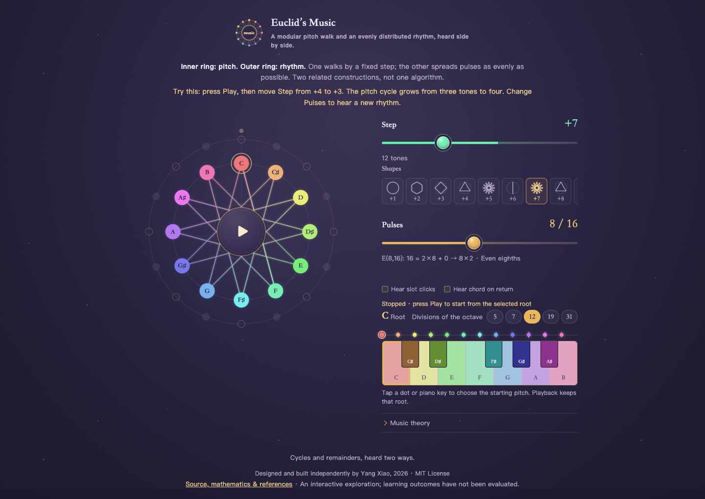
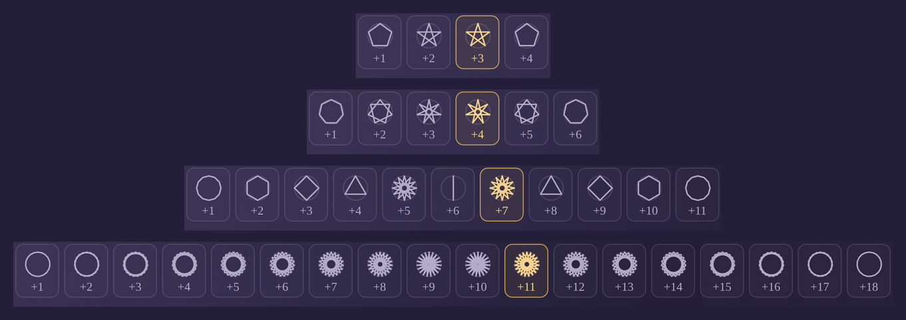
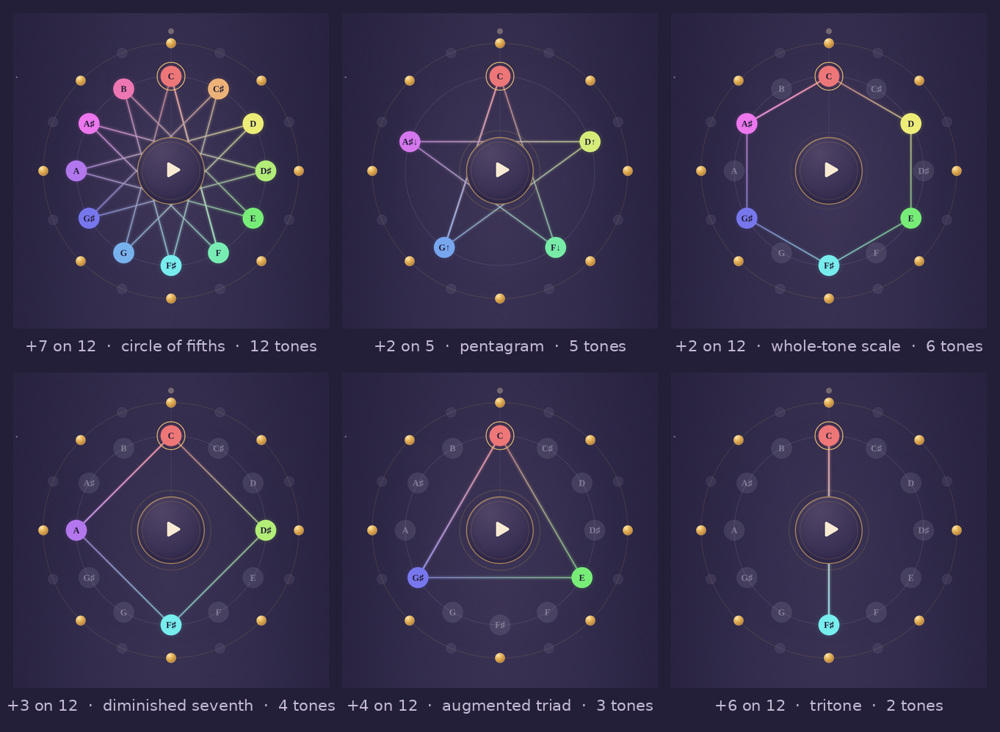
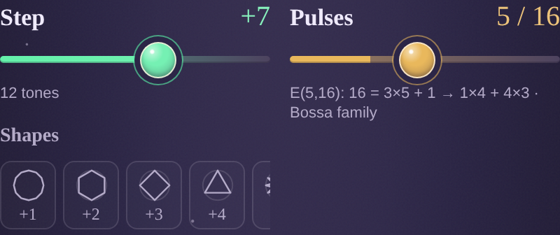
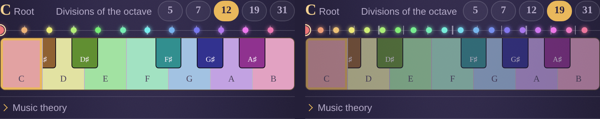
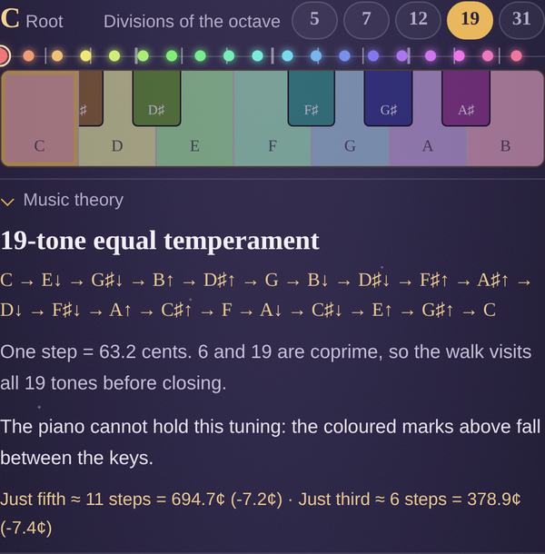

# Euclid's Music

### A playable mathematics-and-music experiment: two related discrete constructions, heard as pitch and rhythm.

**[Play it](https://yxiao-dev.github.io/euclids-music/)** · one HTML file · no install · works on a phone

Euclid’s Music is an interactive research instrument. It places a modular pitch walk and a Euclidean-rhythm construction in the same playable scene, so that a listener can compare how periodicity, quotient, remainder, and closure become audible in different musical settings.

The two systems are related, but they are not literally the same algorithm. The pitch ring repeatedly adds an integer step in a finite cyclic group. The rhythm ring distributes a chosen number of onsets as evenly as possible across a fixed number of slots. Their comparison—not a claim that harmony and rhythm reduce to one another—is the subject of the instrument.



## Use it in thirty seconds

1. Press the centre control to start playback.
2. Move the **Step** control. Listen for when the pitch path closes, and watch which notes remain in the orbit.
3. Move the **Pulses** control. Compare even divisions with rhythms whose gaps alternate between two lengths.
4. Change **Divisions** to hear how the same pitch construction behaves in another equal temperament. The piano stays fixed at twelve keys deliberately: it makes the tuning mismatch visible.

The full instrument is above: two sliders, two rings, and a piano that never retunes.



Above is every pitch shape the instrument can draw at four divisions of the octave. Each figure is the orbit of one step. When N is prime, every non-zero step reaches every tone, so only full stars appear. When N is composite, non-trivial divisors interrupt the orbit, and hexagons, squares, triangles, and a line emerge. The rows are palindromic because k and N−k generate the same subgroup and traverse it in opposite directions. The twelve-note row is familiar to a pianist: its five distinct shapes correspond to symmetric pitch-class collections in Western music theory.

## 1. Pitch as a modular orbit

Every pitch shape follows one recurrence:

```
next = current + k   (mod N)
```

Add a fixed step, wrap around, and repeat. Algebraically, this is a walk in the cyclic group ℤ/N. The walk must return because the group is finite. Its first-return length is

```
L = N / gcd(k, N)
```

That is the order of k in ℤ/N. The visited set is the cyclic subgroup generated by k, which is also generated by gcd(k, N). The walk therefore does not produce an arbitrary selection of notes: it produces one of the subgroups allowed by the divisors of N.

At N = 12, five of the six subgroup types already have familiar musical names.



| step k | gcd(k,12) | L = tones | polygon | musical name |
|---|---:|---:|---|---|
| 1, 5, 7, 11 | 1 | 12 | 12-pointed star | chromatic set; +7 traverses it as the circle of fifths |
| 2, 10 | 2 | 6 | hexagon | whole-tone scale |
| 3, 9 | 3 | 4 | square | diminished seventh |
| 4, 8 | 4 | 3 | triangle | augmented triad |
| 6 | 6 | 2 | line segment | tritone |

Reading the middle column downward gives the divisor lattice of 12; reading the final column downward gives a compact harmony lesson. The interface does not need to state that fact first: move the step from +1 to +11 and observe what closes.

Two consequences are especially useful in play:

**Inverse steps give congruent shapes.** Since 5 + 7 ≡ 0 (mod 12), +5 and +7 generate the same subgroup and trace the same twelve-pointed star in opposite directions. The circle of fourths and the circle of fifths are one pitch-class set, walked two ways.

**Transposition count equals the gcd.** The transpositions of a subgroup are its cosets, so their number is the index [ℤ/12 : ⟨k⟩] = gcd(k, 12). The augmented triad has four, the diminished seventh has three, and the whole-tone scale has two. This is the group-theoretic form of limited transposition.

## 2. Rhythm as even distribution

The rhythm ring uses a different construction. Given m onsets and n slots, Bjorklund’s algorithm distributes the onsets as evenly as possible. It is closely related to the Euclidean algorithm because both are organised by quotient and remainder; it is not the integer modular orbit used for the pitch ring.

For a Euclidean rhythm E(m,n), the gaps between successive onsets take at most two values:

```
floor(n / m) and ceil(n / m)
```

The number of longer gaps is n mod m. For n = 16:

| m | division | gap multiset | practical listening cue |
|---|---|---|---|
| 5 | 16 = 3·5 + 1 | four 3s, one 4 | bossa family |
| 6 | 16 = 2·6 + 4 | two 2s, four 3s | tresillo ×2 |
| 7 | 16 = 2·7 + 2 | five 2s, two 3s | samba family |
| 4 | 16 = 4·4 + 0 | four 4s | four-on-the-floor |

When the remainder is zero, every gap is equal. Otherwise, the leftover is distributed across the cycle, producing the alternating gap lengths that make the rhythm feel less square. The caption beneath the slider exposes this division while the outer ring makes the distribution visible.



The gcd can help describe periodic repetition in some Euclidean patterns, but it does not by itself determine the locations of the onsets: E(5,16) and E(7,16), for example, both have gcd 1 and are clearly different patterns. The pitch ring and rhythm ring therefore present distinct applications of discrete division. Putting them side by side makes their common concerns—periodicity, closure, quotient, and remainder—available to the ear without collapsing their differences.

## 3. Twelve is a choice, and the keyboard is the evidence

The pitch construction does not require twelve equal divisions of the octave. The **Divisions** control retunes it to 5, 7, 12, 19, or 31 equal divisions. The subgroup structure in section 1 survives because it depends on gcd(k, N), not on the special status of twelve. The piano does not survive: it is a physical twelve-key reference object.



In N-EDO, the closest integer approximation to a just ratio r is

```
round(N · log₂ r)
```

Against a just fifth of 701.96 cents and a just major third of 386.31 cents:

| N | best fifth | error | best major third | error |
|---|---|---:|---|---:|
| 12 | 7 steps, 700.0 | −2.0¢ | 4 steps, 400.0 | **+13.7¢** |
| 19 | 11 steps, 694.7 | −7.2¢ | 6 steps, 378.9 | −7.4¢ |
| 31 | 18 steps, 696.8 | −5.2¢ | 10 steps, 387.1 | +0.8¢ |



Twelve gives a nearly exact fifth while making the major third almost fourteen cents sharp; nineteen improves the third and worsens the fifth; thirty-one improves both. Away from twelve, note labels carry arrows because the pitch falls above or below its nearest piano-key name. The instrument computes these values at runtime.

## 4. Verification

One file. SVG, CSS, and Web Audio. No build step or runtime dependency.

```
node tests/test-logic.mjs                 # 485 assertions, no dependencies
npm i jsdom && node tests/smoke-dom.mjs   # 127 assertions, boots the page headless
```

The logic suite checks the orbit-length identity L = N/gcd(k,N) for every supported step and division, canonical Euclidean rhythms E(3,8), E(5,16), and E(7,16), maximal evenness across pulse counts, tuning, ring geometry, and the cents table above. The DOM suite sweeps both sliders, changes N, and checks that the ring, tuning strip, and fixed piano state update consistently. A Chromium sweep over every supported N, step, and pulse count reports no page errors while audio is playing.

## 5. Research status and scope

**What is established here.** The mathematical and implementation claims above are covered by executable tests. The page is an accurate, constrained visualization and sonification of the constructions it implements.

**What remains a hypothesis.** The design proposes that encountering a pattern before its name may help a learner retain its structure. This repository contains no learner study, so it does not claim that the interface produces understanding, transfer, or musical skill. A useful next study would preregister a short task, record what first-time users identify before opening the theory panel, and report the result regardless of outcome.

**What is outside the model.** The instrument uses a single twelve-key reference piano and five equal temperaments. It does not explain the historical provenance, performance practice, or cultural meaning of named rhythmic families. Mathematics can describe a rhythmic structure; it does not substitute for history or listening.

This project does not claim novelty in modular pitch, Euclidean rhythms, or equal temperament. Its contribution is a playable comparison of the three.

## References

1. Euclid. *Elements*, Book VII. For the Euclidean algorithm and common measure.
2. Bjorklund, E. (2003). *The Theory of Rep-Rate Pattern Generation in the SNS Timing System*. Spallation Neutron Source technical report.
3. Toussaint, G. T. (2005). “The Euclidean Algorithm Generates Traditional Musical Rhythms.” *Proceedings of BRIDGES: Mathematical Connections in Art, Music, and Science*.
4. Messiaen, O. (1944). *The Technique of My Musical Language*. Leduc.
5. Benson, D. J. (2006). *Music: A Mathematical Offering*. Cambridge University Press. For mathematical approaches to pitch and tuning.

## Run

Open `index.html`. Audio begins after the first tap on the centre control. Space toggles playback. Tap any dot or key to set the root. Reduced-motion settings are respected; the interface is keyboard-operable.

To publish: push to GitHub, then Settings → Pages → Deploy from a branch → main / (root).

---

Designed and built by Yang Xiao, 2026, independently. Piano performance and pure mathematics. MIT License.
